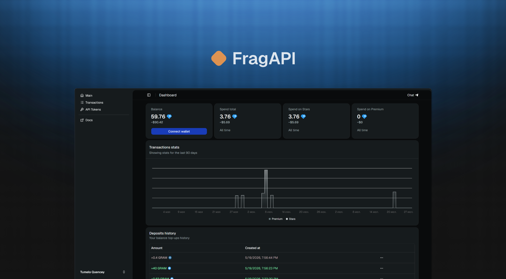

# FragAPI

    

  FragAPI is a service to automate <a href="https://fragment.com">Fragment</a> functionality (via API). Fully open source.

<a href="https://fragapi.com">Website</a>
&nbsp;&nbsp;•&nbsp;&nbsp;
<a href="https://docs.fragapi.com">Docs</a>
&nbsp;&nbsp;•&nbsp;&nbsp;
<a href="https://docs.fragapi.com/ru/docs/api/users/get_api_user_me">API Reference</a>

## What this service do?

Buy telegram stars automatically,
Buy telegram premium automatically.
Send logs about transactions in selected telegram chat.
Show stats about transactions, spending

## Pricing

- Only 0.5% + GRAM network fee (`+- $0.01`) for every transaction.

## Contributions

Our [`DEVELOPMENT.md`](./DEVELOPMENT.md) file contains everything you need to know to configure your development environment.

### Contributors

## License

Licensed under [MIT License](https://mit-license.org/).
